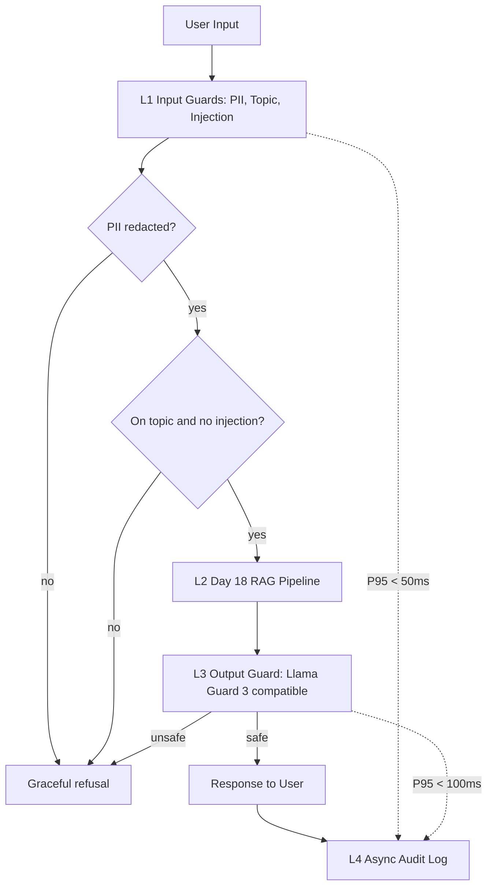

# Production Blueprint - Lab 24 Evaluation and Guardrails

## Section 1: SLO Definition

| Metric | Target | Alert Threshold | Severity |
|---|---:|---:|---|
| Faithfulness | >= 0.85 | < 0.80 for 30 min | P2 |
| Answer Relevancy | >= 0.80 | < 0.75 for 30 min | P2 |
| Context Precision | >= 0.70 | < 0.65 for 1 hour | P3 |
| Context Recall | >= 0.75 | < 0.70 for 1 hour | P3 |
| Guardrail Detection Rate | >= 90% | < 85% daily | P2 |
| False Positive Rate | < 5% | > 10% daily | P2 |
| P95 Guarded Latency | < 2.5s | > 3s for 5 min | P1 |

## Section 2: Architecture Diagram

## Section 3: Alert Playbook

### Incident: Faithfulness drops < 0.80

**Severity:** P2
**Detection:** Continuous eval alert from `ragas_summary.json`.
**Likely causes:** bad retrieval chunks, prompt drift, stale index, or corpus update without re-indexing.
**Investigation steps:** compare context precision over same window, diff prompt version, inspect latest corpus/index job, review bottom 10 failures.
**Resolution:** re-index corpus, increase `top_k`, add reranker, or rollback prompt.
**SLO impact:** track time to detect and time to recover.

### Incident: Guardrail detection rate drops < 85%

**Severity:** P2
**Detection:** Daily adversarial regression suite.
**Likely causes:** new attack pattern, regex gap, topic validator too permissive, or disabled output guard.
**Investigation steps:** group failures by attack type, inspect sanitized text, replay against output guard, check recent rule changes.
**Resolution:** add pattern, update policy corpus, tune refusal thresholds, and rerun adversarial suite.
**SLO impact:** user safety risk until detection returns above target.

### Incident: P95 guarded latency > 3s

**Severity:** P1
**Detection:** Latency dashboard or benchmark regression.
**Likely causes:** slow RAG call, serial guard execution, external safety API latency, or audit logging blocking response path.
**Investigation steps:** compare L1/L2/L3 timings, verify audit is async, check provider status, sample traces.
**Resolution:** parallelize L1 checks, cache topic embeddings, fall back to offline output guard, and move noncritical logging off the request path.
**SLO impact:** degraded user experience and possible timeout risk.

## Section 4: Cost Analysis

Assumption: 100k queries/month.

| Component | Unit Cost | Volume | Monthly Cost |
|---|---:|---:|---:|
| RAG generation (GPT-4o-mini) | $0.001/query | 100k | $100 |
| RAGAS continuous eval (1% sample) | $0.01/query | 1k | $10 |
| LLM judge tier 1 | $0.001/query | 10k | $10 |
| LLM judge tier 2 | $0.05/query | 1k | $50 |
| Presidio / regex PII guard | self-hosted | 100k | $0 |
| Llama Guard self-hosted GPU | $0.30/hour | 720h | $216 |
| **Total** | | | **$386** |

Cost optimizations: sample eval traffic by risk tier, use GPT-4o-mini for first-pass judge, reserve expensive judges for disagreements, cache topic decisions for repeated questions, and switch Llama Guard to API mode for low volume.
